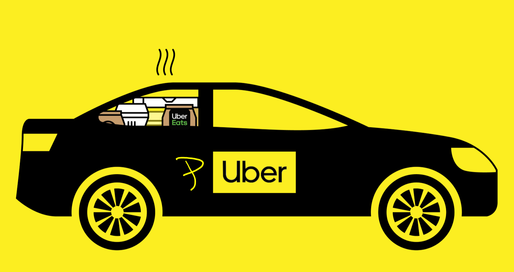

# PUber

## Inspiration 💡
Constantly booking overpriced Ubers and getting jealous of people who own cars. Or the T. Basically anyone who didn't take Ubers. We wanted to beat Uber's volatility in pricing and get the lowest ride price within the near future. 

## What it does 🤨
PUber, or Predictive-Uber for long, accurately predicts Uber prices for the next ten hours based on temperature, cloudiness, chance of rain, humidity, wind speed (MPH), distance, and hour of the day as features. A user can input their "Origin" and "Destination" and the application automatically determines this distance, running this data through our custom Multi-layer Perceptron ML model, and outputs its best prediction for prices in the future. This data is displayed through an interactive chart on the website, showing price predictions for a currently fixed timeframe of 10 hours. 

## How we built it 🛠
- Backend: 
  - Developed Custom REST API with Python Flask library, developed deep learning model with TensorFlow based off of Multi-Layer Perceptron (MLP) neural network trained on over 50k data points, used Google Cloud content to access Google Maps API (a key component within our application) and Weather API to determine distance and weather conditions
  
- Frontend: 
  - Designed minimal and easy to use interface
  - Created frontend with vanilla JavaScript, HTML, and Tailwind CSS

## Challenges we ran into 🥶

We ran into a multitude of issues throughout our experimentation and development process, ranging from small tuning problems to large crashes of our stack. First, our initial React website refused to update compiled changes to local host, and after dozens and dozens of iterations of React Apps, the idea was adjusted and a new website approach was pursued (we think the issue lies with some serviceWorker or caching issue).

Secondly, an example of an issue we faced with the front-end involves a pesky double click bug, where we had to double click the "Calculate" button to display the ride prediction chart. Unfortunately, we wrote over some old code and had to re-find our solution from hours earlier. This ended up being solved by some handy boolean algebra (we were displaying only when our showing value was false, meaning it had to be clicked twice to recognize as true).

Finally, due to some issues with git (and our own mistakes), we overwrote large portions of our one working copy of code, meaning that hours were spent combing through previous git commits and our own memory to reconstruct a working application, bit by bit. Those professors were preaching the power of Git for a reason, it seems. 

Other include: Components not connecting with each other, determining best features to incorporate in model, fine-tuning, getting custom API to return responses

## Accomplishments that we're proud of 🏆
- Continuous Integration with ML pipeline 
- **Custom PUber API** so anyone can use this trained model for their own projects
- **Full-Stack Application** with Flask, TensorFlow, Scikit-Learn, JavaScript, HTML, and CSS
- Comprehensive exploratory data analysis and combination of **novel machine learning and deep learning techniques** (successfully developed two different models based on a variety of features discussed above)
  - **92% accuracy** for random forest classifier in balanced setting
  - MLP model trained on over 50k points, is **less than a dollar within range** of predicting price of $6 to $44 Uber rides

## What we learned 📚
- Full stack development (managing frontend and backend)
- Building scalable machine learning and deep learning systems
- Creating responsive websites with JavaScript, Html, and CSS
- Learning the importance of Git

## What's next for PUber 🔮 
- Uber Button for ease of access when finalizing rides
- Use traffic data to more accurately analyze price fluctations
- Updating UI to be more interactive (and look prettier) with more React animations
- Hosting on website (add AWS Lambda for API Queries)
- Adding other features besides weather to further improve model accuracy
- Adding functionality for other ride service prediction (such as Lyft, taxis, etc)
- Add in Uber's exact price API for more accurate real-time pricing

